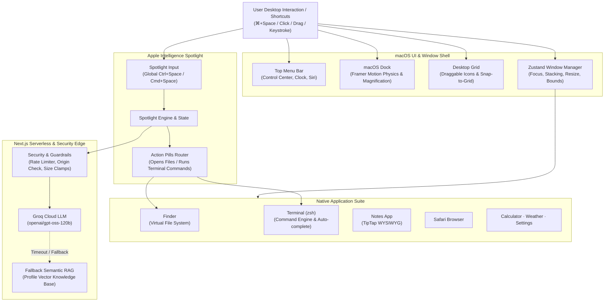

<div align="center">

#  macOS Portfolio OS

### An Interactive, Web-Native macOS Sequoia Desktop Environment & Production AI Systems Showcase
**Engineered by [Yamin Hossain](https://github.com/yamin-H)**

[-black?style=for-the-badge&logo=next.js)](https://nextjs.org/)
[](https://react.dev/)
[](https://www.typescriptlang.org/)
[](https://tailwindcss.com/)
[](https://zustand-demo.pmnd.rs/)
[](https://groq.com/)
[](https://vercel.com)

<br />

[**Explore Live Demo**](https://yamin-portfolio-os.vercel.app) · [**Report Bug**](https://github.com/yamin-H/Portfolio-MacOS/issues) · [**Request Feature**](https://github.com/yamin-H/Portfolio-MacOS/issues)

</div>

---

## 🧭 Table of Contents

- [Overview](#-overview)
- [Architecture & System Design](#-architecture--system-design)
- [Key Features](#-key-features)
  - [1. macOS Desktop & Window Physics](#1-macos-desktop--window-physics)
  - [2. Apple Intelligence Spotlight (Autonomous AI Agent)](#2-apple-intelligence-spotlight-autonomous-ai-agent)
  - [3. Interactive macOS Terminal (zsh)](#3-interactive-macos-terminal-zsh)
  - [4. Finder & Custom UI Engines](#4-finder--custom-ui-engines)
  - [5. Native Applications Suite](#5-native-applications-suite)
  - [6. Production Security & Rate Limiting](#6-production-security--rate-limiting)
- [Tech Stack](#-tech-stack)
- [Project Structure](#-project-structure)
- [Getting Started](#-getting-started)
  - [Prerequisites](#prerequisites)
  - [Installation](#installation)
  - [Environment Variables](#environment-variables)
  - [Development Server](#development-server)
  - [Production Build](#production-build)
- [Deployment on Vercel](#-deployment-on-vercel)
- [Flagship Production Projects](#-flagship-production-projects)
- [Author & Contact](#-author--contact)
- [License](#-license)

---

## 🖥️ Overview

**macOS Portfolio OS** is not merely a portfolio—it is a fully functional, browser-based operating system inspired by **macOS Sequoia**, designed to showcase real-world production engineering, distributed systems architectures, and autonomous AI agents.

Built with **Next.js 16 (Turbopack)**, **React 19**, **TypeScript**, and **Tailwind CSS v4**, this project demonstrates how to deliver high-performance 60fps desktop physics, complex state management, and real-time LLM inference in modern web standards without external desktop runtimes (like Electron).

### Highlights
- 🧠 **Dual-Engine AI Representative**: An integrated **Apple Intelligence Spotlight** agent powered by Groq's high-speed `openai/gpt-oss-120b` with seamless zero-crash failover to an embedded semantic RAG engine.
- 🪟 **True Desktop Window Manager**: Multi-window stacking context, z-index elevation, fluid dragging, border resizing, minimize/maximize animations, and active keyboard event dispatching.
- 🖥️ **Pixel-Perfect macOS Terminal**: Emulates `zsh` with full command history, tab completion, ANSI colors, neofetch system cards, and interactive easter eggs (`matrix`, `cowsay`, `screensaver`).
- 📁 **Custom File Renderers**: Interactive ASCII terminal summary cards, modular engineering philosophy cards, and rich WYSIWYG note editing.
- 🛡️ **Hardened Production Security**: In-memory sliding-window IP rate limiting, strict payload size limits, reverse proxy host validation, and bank-grade HTTP response headers (HSTS, X-Frame-Options, nosniff).

---

## 🏛️ Architecture & System Design



---

## ✨ Key Features

### 1. macOS Desktop & Window Physics
- **Floating Window Manager**: Built on top of a centralized Zustand store (`windowStore.ts`). Every window features smooth dragging, 8-directional edge resizing, minimizing to dock with genie-style effects, maximizing, and responsive viewport clamping.
- **Intelligent Stacking (z-index)**: Clicking any window brings it to the active foreground; unfocused windows automatically dim their traffic light controls and window titles.
- **Native Desktop Icons**: Right-column desktop icons with precision **snap-to-grid collision detection**, multi-row auto-reflow, word-wrapping without truncation, and custom icon assets.

### 2. Apple Intelligence Spotlight (Autonomous AI Agent)
- **Universal Shortcut**: Summoned anywhere via <kbd>⌘</kbd> + <kbd>Space</kbd> (Mac) or <kbd>Ctrl</kbd> + <kbd>Space</kbd> (Windows/Linux).
- **Conversational Intelligence**: Directly answers questions about Yamin's distributed system projects, architecture patterns, tech stack choices, and engineering background.
- **Deep Groq Inference (`openai/gpt-oss-120b`)**: Sub-second streaming responses leveraging Groq LPUs.
- **Automated Fallback**: If external API calls fail or offline, an internal vector-like semantic retrieval engine serves verified answers instantly.
- **Contextual Action Pills**: The AI can trigger OS-level actions—such as opening specific files inside Finder or executing deep-dive commands in Terminal.

### 3. Interactive macOS Terminal (`zsh`)
- Emulates the macOS terminal experience at `yamin@Yamins-MacBook-Air ~ %`.
- **Supported Commands**:
  - Navigation: `ls`, `cd`, `pwd`, `open <file>`
  - Document viewing: `cat <file.md>`
  - System diagnostics: `neofetch`, `whoami`, `date`, `echo`, `man <cmd>`, `history`
  - Contact links: `contact`
  - Themes: `theme [apple|matrix|cyberpunk|dracula]`
  - Fun & Easter Eggs: `matrix` (falling green glyphs), `screensaver`, `cowsay <text>`, `sudo`
- **Tab Autocompletion**: Autocompletes commands and virtual file paths.
- **Arrow-Key History**: Navigate previous inputs using <kbd>↑</kbd> and <kbd>↓</kbd>.
- **Global Keystroke Redirection**: Typing while the terminal window is active automatically routes keystrokes straight to the shell prompt.

### 4. Finder & Custom UI Engines
- **Virtual File System (VFS)**: Organized into structured directories: `Projects`, `About`, `Documents`, and `Desktop`.
- **Neofetch Terminal Card**: 2-column retro terminal card showing ASCII block art ("YAMIN") alongside key-value telemetry and interactive social pills (GitHub, LinkedIn, Email).
- **Engineering Philosophy Cards**: Modular cards featuring glowing accent borders, hover illumination, and zero bullet points for high readability.

### 5. Native Applications Suite
- 📝 **Notes**: Full-featured rich text editor powered by **TipTap 3** supporting bold, italics, tables, task checklists, and code formatting.
- 🧭 **Safari**: Tabbed web browser interface with macOS chrome and quick-launch bookmarks.
- 🧮 **Calculator**: Functional macOS calculator with memory operations and keyboard input.
- ⛅ **Weather**: Dynamic live weather dashboard with multi-day forecasts and visual condition cards.
- ⚙️ **System Settings**: Customize desktop wallpapers, toggle dark/light mode, and adjust sound and dock preferences.
- 📄 **Resume Viewer**: Instant PDF preview and one-click download for Yamin Hossain's resume.

### 6. Production Security & Rate Limiting
- **Sliding-Window IP Rate Limiter**: 25 requests per minute sliding window implemented in TypeScript memory store with auto-pruning.
- **Payload Guardrails**: Maximum 2,000 characters per user message and conversation history truncated to prevent memory exhaustion and buffer overflow attacks.
- **Reverse Proxy & Host Verification**: Verifies `Host` and `x-forwarded-host` headers to neutralize CSRF and unauthorized cross-domain hijacking.
- **Hardened HTTP Headers**:
  - `Strict-Transport-Security: max-age=63072000; includeSubDomains; preload`
  - `X-Frame-Options: SAMEORIGIN`
  - `X-Content-Type-Options: nosniff`
  - `Referrer-Policy: strict-origin-when-cross-origin`
  - `Permissions-Policy: camera=(), microphone=(), geolocation=()`
  - `X-Powered-By`: Removed to prevent stack fingerprinting.

---

## 🛠️ Tech Stack

| Domain | Technology | Purpose |
|---|---|---|
| **Framework** | [Next.js 16](https://nextjs.org/) (App Router & Turbopack) | Modern React server components, serverless API routes, optimized bundles |
| **UI Library** | [React 19](https://react.dev/) | Core UI rendering with concurrent features and hooks |
| **Language** | [TypeScript 5](https://www.typescriptlang.org/) | End-to-end type safety across stores, components, and API routes |
| **Styling** | [Tailwind CSS v4](https://tailwindcss.com/) | High-performance atomic utility styling with native CSS variables |
| **State Management** | [Zustand 5](https://github.com/pmndrs/zustand) | Lightweight, predictable store for windows, active app, and OS state |
| **Animations** | [Framer Motion 13](https://www.framer.com/motion/) | Smooth spring physics for dock magnification and window transitions |
| **Rich Text Editor** | [TipTap 3](https://tiptap.dev/) | Headless extensible WYSIWYG engine for the Notes application |
| **AI Inference** | [Groq Cloud](https://groq.com/) | Ultra-fast inference with `openai/gpt-oss-120b` |
| **RAG / Vector** | Custom Semantic Retriever | In-memory verified knowledge base with cosine similarity search |
| **Icons** | [Lucide React](https://lucide.dev/) | Clean, scalable macOS-style icons |

---

## 📂 Project Structure

```
portfolio-os/
├── public/                       # Static assets (wallpapers, icons, resume PDF)
│   ├── appstore.png
│   ├── finder.png
│   ├── macos.jpg
│   ├── terminal.png
│   └── Yamin_Hossain_Resume.pdf
├── src/
│   ├── app/
│   │   ├── api/
│   │   │   └── chat/route.ts     # Edge API route for Apple Intelligence Spotlight
│   │   ├── components/os/        # Core desktop layouts & Window Manager
│   │   │   ├── Desktop.tsx
│   │   │   └── WindowManager.tsx
│   │   ├── store/
│   │   │   └── windowStore.ts    # Centralized Zustand OS state
│   │   ├── globals.css           # Global macOS glassmorphism & typography
│   │   └── layout.tsx            # Metadata, OpenGraph & root HTML shell
│   ├── components/
│   │   ├── apps/                 # Native Applications
│   │   │   ├── AssistantSpotlight.tsx # Apple Intelligence Chat & Command Center
│   │   │   ├── Finder.tsx        # File manager with custom UI renderers
│   │   │   ├── Terminal.tsx      # macOS zsh shell emulation
│   │   │   ├── NotesApp.tsx      # TipTap rich text document editor
│   │   │   ├── Safari.tsx        # Web browser simulator
│   │   │   ├── Calculator.tsx    # macOS Calculator app
│   │   │   ├── WeatherApp.tsx    # Live weather forecasts
│   │   │   └── Settings.tsx      # System Preferences
│   │   └── os/                   # OS Shell Controls
│   │       ├── DesktopIcons.tsx  # Snap-to-grid desktop icons
│   │       ├── Dock.tsx          # macOS Dock with spring magnification
│   │       ├── MenuBar.tsx       # Top system status bar
│   │       └── ControlCenter.tsx # Quick toggles (Wi-Fi, Display, Sound)
│   ├── data/
│   │   └── content.ts            # Ground truth knowledge base & file system nodes
│   └── lib/
│       ├── agent/                # Semantic RAG retriever & local inference engine
│       │   ├── engine.ts
│       │   ├── knowledge.ts
│       │   └── retriever.ts
│       └── security/
│           └── rateLimiter.ts    # In-memory sliding-window IP rate limiter
├── .env.example                  # Environment variables template
├── next.config.ts                # Security headers, Turbopack rules, asset config
├── package.json
└── tsconfig.json
```

---

## 🚀 Getting Started

### Prerequisites
- **Node.js**: `v18.17.0` or later (Node.js 20+ recommended)
- **Package Manager**: `npm`, `pnpm`, or `yarn`

### Installation

1. **Clone the repository**:
   ```bash
   git clone https://github.com/yamin-H/Portfolio-MacOS.git
   cd Portfolio-MacOS
   ```

2. **Install dependencies**:
   ```bash
   npm install
   ```

### Environment Variables

Copy `.env.example` to create your local `.env.local`:
```bash
cp .env.example .env.local
```

Open `.env.local` and add your **Groq Cloud API Key**:
```env
# GROQ Cloud API Key (Get free key at: https://console.groq.com/keys)
GROQ_API_KEY=gsk_your_groq_api_key_here

# Model Identifier (defaults to openai/gpt-oss-120b)
GROQ_MODEL=openai/gpt-oss-120b
```

> **Note**: Even without a Groq API key, the portfolio will automatically use the built-in local semantic RAG retriever. Adding an API key enables live LLM conversational reasoning.

### Development Server

Start the local development server:
```bash
npm run dev
```

Open [http://localhost:3000](http://localhost:3000) in your browser.

### Production Build

To test the production build locally:
```bash
npm run build
npm run start
```

---

## ☁️ Deployment on Vercel

The easiest way to deploy this portfolio is using the [Vercel Platform](https://vercel.com):

1. **Push your repository** to GitHub:
   ```bash
   git push origin main
   ```
2. Navigate to [Vercel](https://vercel.com/new) and click **"Add New Project"**.
3. Import your `Portfolio-MacOS` repository.
4. In **Project Settings** &rarr; **Environment Variables**, add:
   - `GROQ_API_KEY`: Your Groq Cloud API key.
   - `GROQ_MODEL`: `openai/gpt-oss-120b` *(optional)*.
   - `NEXT_PUBLIC_SITE_URL`: Your custom domain or Vercel URL *(optional, for OpenGraph previews)*.
5. Click **Deploy**. Vercel will build and launch your macOS Portfolio OS in under 60 seconds!

---

## 🏆 Flagship Production Projects

The portfolio showcases real systems engineered with an emphasis on reliability, observability, and scale:

### 1. PR Review Agent (Live Marketplace GitHub App)
- **Problem**: Code review comments often give generic advice while ignoring past team architectural discussions and decisions.
- **Solution**: Ingests 6 months of a team's merged PR discussions and commit diffs into a 384-dimensional **pgvector** embedding store. Uses a **6-node LangGraph pipeline** with chunked diff processing to cite exact past decisions (e.g., *"Team rejected this connection pattern in PR #234 due to pool exhaustion"*).
- **Stack**: Next.js · TypeScript · Node.js · Express · Python · FastAPI · LangGraph · pgvector · BullMQ · Redis · Docker.

### 2. Autonomous Bug Reproducer (End-to-End Debugging Service)
- **Problem**: Autonomous agents frequently get stuck in infinite loops when tests fail for unexpected reasons.
- **Solution**: Takes a GitHub issue URL, provisions an isolated Docker sandbox, reproduces the bug, generates a failing test, diagnoses failure logs with a **7-node LangGraph pipeline** featuring conditional failure classification edges, patches the source code, and opens a verified PR.
- **Stack**: Next.js · Python · FastAPI · LangChain · LangGraph · PostgreSQL · Prisma · BullMQ · Redis · Docker.

### 3. Remotion Open Source Contributions (52k+ Stars)
- Contributed `preserveSilence` in `renderMediaOnWeb()` to guarantee silent audio head/tail frames are preserved for ASR transcription pipelines ([PR #7074](https://github.com/remotion-dev/remotion/pull/7074)).
- Extended `playbackRate` validation from $\pm4$ to $\pm10$ with unit regression test suites ([PR #7107](https://github.com/remotion-dev/remotion/pull/7107)).

---

## 👨‍💻 Author & Contact

**Yamin Hossain**  
*AI-Native Software Engineer · Distributed Systems & Production LLM Pipelines*  
Rajshahi, Bangladesh · Open to Remote Engineering Teams

- **Portfolio**: [yamin-portfolio-os.vercel.app](https://portfolio-mac-nzintuv7k-yamin-hs-projects.vercel.app/)
- **Email**: [yamindr3@gmail.com](mailto:yamindr3@gmail.com)
- **GitHub**: [@yamin-H](https://github.com/yamin-H)
- **LinkedIn**: [in/yamin-hossain-n](https://www.linkedin.com/in/yamin-hossain-n/)

---

## 📄 License

This project is licensed under the [MIT License](LICENSE) — feel free to explore, learn from it, and adapt it for your own portfolio systems!

<div align="center">
  <sub>Designed & engineered with precision to reflect the craftsmanship of macOS Sequoia.</sub>
</div>
